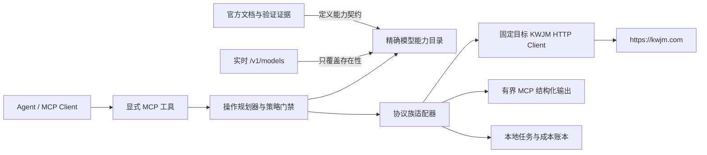

# KWJM MCP 全模型协议架构设计

- 日期：2026-08-14
- 状态：架构与图片稳定性排序已由用户确认，进入分阶段实施计划
- 上游：`https://kwjm.com`
- 实时模型基线：2026-08-14T05:49:46.965Z，`GET /v1/models` 返回 109 个精确模型 ID
- 验证口径：全部模型契约覆盖、每个协议族代表实测、高成本逐模型实测另行门禁

本文取代 2026-08-13 设计，并提高后续发布闸门的优先级。此前的 release-closure 和可用性审计只作为
历史运行证据；在本文新增的 109 模型矩阵、协议族适配和代表实测未完成前，不得据其宣称稳定版可发布。

## 1. 目标与成功标准

本项目要发布一个可由开物基模用户直接安装的 npm MCP Server。每位工作室成员只配置自己的
`KWJM_API_KEY`；同一 KWJM 账户下的多个 Key 通过 `KWJM_API_KEY_ID` 做权威归属，从而实现成员成本
分离统计。MCP 不记录提示词、生成内容或媒体数据。

首个稳定版同时满足以下条件才可发布：

1. 实时 `/v1/models` 中的每个精确 ID 都有明确的本地契约状态，不存在按名称或默认模态猜测路由。
2. 所有对外 MCP 工具都有强类型输入、输出、操作级授权和可供 Agent 理解的安全语义。
3. 每个协议族至少选择一个代表模型完成真实调用；文本、图片和视频使用最低可行成本参数。
4. 高成本模型的逐模型真实调用必须另获用户成本授权；未授权不影响其契约覆盖结论。
5. 当前 Key 的日结成本查询闭环可用；跨 Key 汇总只在用户明确要求时发生。
6. 本地账本不含提示词、生成内容、媒体字节或媒体 URL，本地和 Git 历史中不含 API Key。
7. 构建、类型检查、测试、安全检查、npm 打包检查和 GitHub 主分支发布证据齐全。

“模型存在”“契约已知”“协议族代表实测”“该精确模型已实测”是四个独立结论，不得相互替代。

## 2. 第一性原理与不可变约束

### 2.1 模型列表只证明存在性

KWJM `/v1/models` 当前只提供 `created`、`id`、`object`、`owned_by`。这些字段不能证明模型的模态、
操作、端点、必填参数、异步状态协议或成本。因此：

- 实时列表是精确 ID 与可见性的权威来源。
- 官方模型文档是能力和协议契约的首选证据。
- 受控真实调用只能补充验证，不能把一次偶然成功扩张成同族所有模型的能力声明。
- 模型名相似、厂商相同或前缀相同都不是继承协议的充分条件。

### 2.2 “能被发现”不等于“允许执行”

未知或证据不足的实时模型必须显示在发现结果中，但执行必须失败关闭。即使调用方传入
`explicit: true`，也只能解除“非默认选择”限制，不能绕过缺失的操作契约。

### 2.3 有副作用的网络调用是成本边界

生成请求可能计费且 POST 的响应丢失不代表请求未提交。因此：

- 付费或其他有副作用的 POST 默认不自动重试。
- 媒体和高成本操作先规划、后执行，并绑定短期 `plan_id`。
- 状态查询等只读 GET 可以有限重试。
- 无官方幂等键保证时，超时或断连标记为 `submission_uncertain`，由用户决定后续动作。

### 2.4 Agent 安全来自显式契约

“图片模型”“视频模型”等宽泛标签不足以决定工具。授权必须细化到具体操作，例如
`image.generate`、`image.edit`、`video.image_to_video`、`asset.delete`。工具名称、描述、Schema、
返回值和服务端指令必须表达同一套边界。

## 3. 当前基线与必须修复的问题

当前实现的测试和构建虽已通过，但它们只证明现有行为自洽，不能证明上游协议正确。审计基线如下：

- 静态注册表有 58 个条目，其中只有 41 个是实时列表中的同名精确 ID。
- 其余 68 个实时 ID 会被 `mergeLive` 默认创建为文本模型并路由到 `/v1/chat/completions`。
- `ModelCapability.modality` 是单值，无法表达多模态模型和一对多操作关系。
- 当前工具主要按模态校验，不能阻止 Responses、Messages、图像编辑或视频子协议之间的串路由。
- 当前 `server.tool()` 注册方式缺少现代 MCP 的 `outputSchema`、`structuredContent` 和标准注解。
- 异步图片和视频共用含糊的结果查询，未知任务可能落入错误默认端点。
- 生成结果可能把完整上游 JSON 或 base64 媒体塞进文本上下文。
- 注册表和协议逻辑集中在单个大文件，广泛使用 `any`，不利于审计和扩展。

新架构必须先消除上述不安全默认值，再增加新能力。

## 4. 总体架构



系统拆成六个边界：

1. **实时模型快照**：只记录精确 ID、上游字段、抓取时间和可见性。
2. **策展能力目录**：记录操作、协议、证据、选择级别、成本风险和验证状态。
3. **操作规划器**：在网络调用前解析模型、验证参数、说明成本因子并签发执行计划。
4. **协议族适配器**：负责路径、请求构造、响应解析、任务状态和安全重试。
5. **MCP 表面**：提供强类型工具、结构化返回和 Agent 工作流说明。
6. **本地账本**：只记录非内容元数据、异步任务绑定和日结归属。

建议目录边界：

```text
src/
  catalog/       # 实时快照、策展模型目录、证据与选择策略
  protocols/     # 按协议族拆分的请求/响应/状态适配器
  planning/      # 操作授权、参数归一化、plan_id 与成本门禁
  ledger/        # 本地任务、用量与日结账本
  tools/         # MCP 工具定义和输出整形
  transport/     # 固定 KWJM Base URL、鉴权、SSE 与错误归一化
  schemas/       # Zod 输入输出和未知响应的类型守卫
```

## 5. 模型目录与证据模型

### 5.1 模型档案

每个实时精确 ID 对应一个 `ModelProfile`，概念结构如下：

```ts
type SupportStatus =
  | "verified"
  | "documented"
  | "unverified_variant"
  | "blocked";

interface ModelProfile {
  exactId: string;
  family: string;
  modalities: Modality[];
  availability: "available" | "missing" | "unknown";
  catalogStatus: SupportStatus;
  operationContracts: Partial<Record<OperationId, {
    protocolProfile: string;
    supportStatus: SupportStatus;
    selectionLevel: "default" | "fallback" | "off_by_default";
    costRisk: "low" | "medium" | "high" | "unknown";
    costFactors: CostFactor[];
    requirements: Requirement[];
    evidence: EvidenceRef[];
    verification: VerificationRecord;
  }>>;
}
```

约束：

- `exactId` 是请求时唯一可透传的权威模型标识。
- 实时同名 ID 永远不能被当作别名重写成另一个模型。
- 别名只用于未命中精确 ID 后的交互式解析，歧义时返回候选而不猜测。
- 一个模型可以有多个模态和多个操作；协议、证据、成本和验证状态都按操作记录，不能用单一模型级
  状态掩盖部分支持。
- `catalogStatus` 只是列表展示用的最保守汇总，操作授权只读取目标操作的 `operationContracts`；默认、
  备选和非指明不调用也按操作判定。
- 没有 `documented` 或 `verified` 操作契约的模型/操作单元没有可执行路由；目录汇总为
  `unverified_variant` 或 `blocked` 时全部失败关闭。
- 实时刷新不得覆盖策展能力，只能更新 `availability` 和上游原始元数据。
- 阻塞记录必须携带机器可读原因，例如缺文档、已知不支持、缺输入、缺授权或待成本门禁。

操作级 `supportStatus` 的含义固定为：`documented` 表示已有精确官方协议证据；`verified` 表示该操作的
协议适配器和本地契约测试已通过，并有精确文档或受控真实调用支撑；`unverified_variant` 表示只能证明
模型存在；`blocked` 表示已知不支持或缺少不可绕过的前置条件。状态升级必须附加证据，不能由名称继承。
`exact_live` 仍是独立维度，只能证明该精确模型的该项操作在某时成功，不能自动证明其他操作。

### 5.2 证据分层

每条能力至少带一个含 URL、日期和类型的证据引用：

| 证据类型 | 能证明什么 | 不能证明什么 |
|---|---|---|
| `live_list` | 精确 ID 当时存在 | 模态、端点、参数、价格 |
| `official_doc` | 文档所述的操作与协议 | 当前账户一定有权限、调用一定成功 |
| `operator_observation` | 工作室长期使用中的相对稳定性与选择偏好 | 协议、能力或未来稳定性的客观保证 |
| `contract_test` | 本地 Schema 与适配器一致 | 上游当前可用 |
| `representative_live` | 该协议族的代表调用成功 | 同族每个精确模型都成功 |
| `exact_live` | 该精确模型与操作成功 | 未来持续可用或固定价格 |

### 5.3 2026-08-14 未获精确官方映射的 55 个 ID

以下实时 ID 在已抓取的 62 页模型文档正文中没有精确同名映射。它们必须保留为
`unverified_variant` 或 `blocked`，直到获得官方文档或受控验证证据：

```text
Doubao-Seedance-1-0-pro-fast
MiniMax-M2.7
MiniMax-M3
claude-fable-5
claude-haiku-4-5-20251001-hq
claude-haiku-4-5-aws
claude-opus-4-6-aws
claude-opus-4-6-hq
claude-opus-4-7-aws
claude-opus-4-7-hq
claude-opus-4-8-aws
claude-opus-5
claude-sonnet-4-5-20250929-hq
claude-sonnet-4-6-aws
claude-sonnet-4-6-hq
claude-sonnet-5
deepseek-v4-flash
deepseek-v4-pro
doubao-seed-1-6
doubao-seed-1-8
doubao-seed-2-0-lite
doubao-seed-2-0-pro
doubao-seedance-1-0-pro
doubao-seedream-4-0
doubao-seedream-4-5
gemini-2.5-flash-image-hq
gemini-3-pro-image-preview-hq
gemini-3.1-flash-image-preview-hq
gemini-3.1-flash-image-preview-wc
gemini-3.5-flash
glm-5.1
glm-5.2
gpt-5.3-codex
gpt-5.4-hq
gpt-5.4-pro
gpt-5.6-luna
gpt-5.6-sol
gpt-5.6-terra
gpt-image-2-hq
gpt-image-2-sp
grok-4-1-fast-non-reasoning
grok-4-1-fast-reasoning
grok-4.5
hy3
kimi-k3
kling-v2.6-pro-gp
kling-video-o1-std-gp
kw-video-v2-mini
kw-video-v2.5
openai/gpt-5.4
openai/gpt-5.5
openai/gpt-image-2
qwen3.7-max
qwen3.7-plus
sd-video-enhance-ext
```

这份列表是时间点证据，不是永久黑名单。刷新后新增的 ID 自动进入同样的失败关闭状态。

## 6. 协议族，而不是模型名分支

`ProtocolProfile` 定义操作、HTTP 方法、路径模板、查询路径、请求构造器、响应解析器、状态适配器、
输出整形、成本因子、前置条件和重试规则。模型档案只引用协议档案，避免复制协议逻辑。

必须覆盖的上游协议族包括：

| 协议族 | 主要操作与端点 |
|---|---|
| OpenAI Chat | `POST /v1/chat/completions`，普通与 SSE 流式、工具调用、图片理解 |
| OpenAI Responses | `POST /v1/responses`，普通与流式、多模态输入、工具调用 |
| Anthropic Messages | `POST /v1/messages`，Anthropic 头、普通与流式、工具调用、图片理解 |
| Gemini Native | `POST /v1beta/models/{model}:generateContent` 与 `:streamGenerateContent` |
| OpenAI Image | `POST /v1/images/generations`、`POST /v1/images/edits` |
| 异步 Image | `POST /v1/images/generations/tasks` 及对应任务查询 |
| Kling Image | `/images/generations/tasks` 及对应任务查询 |
| KWJM Video | `POST /v1/videos/generations` 及 `GET /v1/videos/generations/{id}` |
| 内容任务 | `POST /v3/contents/generations/tasks` 及对应任务查询 |
| Doubao Video | `POST /api/v1/services/aigc/video-generation/video-synthesis` 与 `/api/v1/tasks/{id}` |
| Kling Video | `/v1/videos/text2video`、`image2video`、`video2video`、`reference` 与 `/v1/general/query/{id}` |
| Video Create | `POST /v1/videos/create` 与 `/v1/videos/generations/{id}` |
| OpenAI-style Video | `POST /v1/videos`、`GET /v1/videos/{id}` 与 `/content` |
| MiniMax Video | `/v2/video_generation`、`/v2/video_regeneration` 与 `/v2/query/video_generation/{id}` |
| 视频增强 | `/v3/tools/enhance-video-generative`、自动增强内容任务与各自查询端点 |
| 字幕擦除 | `/v3/tools/erase-video-subtitle` 与文档确认后的任务查询端点 |
| TTS 与声音 | 对应文本转语音协议及 `GET /v1/general/custom-voices` |
| 资产管理 | `/v3/open/` 下 Asset Group 与 Asset 的创建、查询、更新和删除 |
| 兼容旧协议 | 官方仍要求的 DashScope/Qwen 图像或视频端点，单独适配而不伪装成 OpenAI 协议 |

路径模板必须在发送前完成模型和任务 ID 替换。任何缺少精确协议档案的请求都在本地拒绝，不触网。

## 7. MCP 工具表面与 Agent 语义

### 7.1 注册契约

所有工具改用 SDK 的 `registerTool`，并提供：

- 明确的 `title` 和面向 Agent 的操作边界描述。
- 严格的 `inputSchema` 与 `outputSchema`，上游未知数据先按 `unknown` 接收再经类型守卫解析。
- `structuredContent` 作为机器结果，同时保留简短文本摘要供旧客户端显示。
- 标准 `annotations`：只声明只读、破坏性、幂等性和开放世界属性。
- 成本风险、计划要求和重试语义写入工具描述及规划结果，不伪造非标准注解字段。

本期不采用 SDK 的实验性 Tasks API。上游异步任务通过稳定的显式工具和本地账本管理，避免客户端兼容性
及未来 SDK v2 迁移风险。

### 7.2 工具分组

正式工具使用 `kwjm_` 前缀并按操作拆分：

- 发现与规划：`kwjm_list_models`、`kwjm_get_model`、`kwjm_refresh_models`、
  `kwjm_plan_operation`。
- 文本：`kwjm_chat_completions`、`kwjm_responses`、`kwjm_messages`、
  `kwjm_gemini_generate_content`。
- 图片：`kwjm_generate_image`、`kwjm_edit_image`；异步结果统一由任务工具查询。
- 视频：`kwjm_text_to_video`、`kwjm_image_to_video`、`kwjm_video_to_video`、
  `kwjm_reference_to_video`、`kwjm_regenerate_video`。
- 异步任务：`kwjm_get_task`，依赖账本中的精确协议绑定；未命中时要求显式协议和模型，绝不猜端点。
- 音频与声音：`kwjm_text_to_speech`、`kwjm_list_custom_voices`。
- 处理工具：`kwjm_enhance_video`、`kwjm_erase_video_subtitle`。
- 资产：`kwjm_create_asset_group`、`kwjm_list_asset_groups`、`kwjm_get_asset_group`、
  `kwjm_update_asset_group`、`kwjm_delete_asset_group`，以及对应的五个 `kwjm_*_asset` 工具。
- 成本：`kwjm_get_current_key_daily_cost`、`kwjm_get_account_daily_costs`、
  `kwjm_get_wallet_balance`。

若旧工具名需在首个稳定版前兼容，只允许做带弃用说明的薄包装；包装仍必须走同一操作规划和协议授权，
不得保留旧的模态猜测逻辑。

### 7.3 服务端工作流指令

MCP Server 的 `instructions` 明确告诉 Agent：

1. 先发现或刷新模型，再按精确 ID 获取能力。
2. 不根据模型名推断操作；只使用档案中明确列出的 `operations`。
3. 媒体或高成本操作先调用规划工具并展示成本因子和未知项。
4. 付费 POST 断连后不得自动重提；先查询已有任务或向用户说明状态不确定。
5. 默认成本查询只看当前 Key；跨 Key 汇总需要用户明确表达“所有 API Key”或等价意图。

### 7.4 流式与工具调用契约

Chat、Responses、Messages 和 Gemini Native 分别使用各自的 SSE 事件解析器，不把一种协议的事件名或
终止条件套到另一种协议。流式实现必须：

- 支持客户端取消并立即中止上游请求。
- 逐事件做大小、总字节数和总事件数限制，处理拆包、注释行、心跳和不完整尾帧。
- 客户端提供 MCP `progressToken` 时发送有界进度；最终结果只返回聚合后的必要字段。
- 不把原始 SSE、增量内容或工具参数写入账本和日志。
- 在连接中断时区分“未收到任何上游事件”和“已开始生成”，不自动重发付费请求。

工具调用采用统一的本地抽象表达工具名、描述和 JSON Schema，但协议适配器必须显式完成
OpenAI Chat、Responses、Anthropic Messages 与 Gemini 的请求和结果映射。未知 finish reason、工具参数
JSON 不完整、并行工具调用或协议不支持的字段都返回明确错误或原始状态，不能静默改写为普通文本。

## 8. 操作规划与防重复计费

`kwjm_plan_operation` 是纯本地、只读、非计费工具，返回：

- 精确模型 ID、操作 ID 和协议档案 ID。
- 将要使用的方法与端点模板，但不返回或记录凭据。
- 归一化后的非内容参数、平台默认值、必填媒体或资产条件。
- 分辨率、时长、数量、质量、音频长度等成本因子。
- 已知或未知的价格状态、成本风险、是否可能计费。
- 是否允许自动重试、可能出现的 `submission_uncertain` 风险。
- 支撑该契约的证据与仍未验证的部分。

规划结果只能包含枚举值、字段是否存在、数量、字节数、时长、分辨率、质量档位等非内容元数据。
提示词、messages、工具实参、媒体 URL、base64、生成内容、原始响应和内部 HMAC 不得进入
`structuredContent` 或文本摘要。

媒体、高成本和破坏性操作需要短期、单次使用的 `plan_id`。规划器用本地随机密钥对规范化输入生成 HMAC
指纹，并绑定当前 Key ID、精确模型、操作和协议；执行时重新计算并验证。开始提交后立即把计划标记为
已使用，即使随后断连也不能重放。账本只保存 HMAC 和非内容元数据，不能保存原始提示词，也不能用可被
字典攻击的裸哈希。本地 HMAC 密钥独立生成、以 `0600` 保存，不从 API Key 派生。

官方目前没有文档化的精确价格 API，因此系统不得伪造逐任务精确费用。规划器只报告官方可证实的成本
因子和风险等级；若响应返回可靠 usage/cost 则记录，否则以日结统计作为权威成本闭环。

## 9. 异步任务、输出与本地账本

### 9.1 统一状态

各协议的原始状态归一化为：

```text
queued | processing | succeeded | failed | cancelled | unknown
```

同时保留原始状态字符串。任务查询必须使用创建时绑定的协议档案，不能在缺少模型信息时回退到通用视频
端点。

### 9.2 账本字段与隐私边界

账本默认放在操作系统用户数据目录中的 KWJM MCP 专用目录，文件权限为 `0600`，采用原子写入和进程间
互斥，避免多个 Agent 同时运行时覆盖或截断。记录：

- 本地操作 ID、精确模型 ID、操作 ID、协议档案 ID、端点 ID。
- `KWJM_API_KEY_ID`，不记录 `KWJM_API_KEY`。
- 上游任务 ID、创建/更新时间、归一化状态和原始状态。
- 输入的非内容元数据，例如图片数量、时长、分辨率、输出数量和质量档位。
- 上游实际返回的 usage/cost 字段及其来源；没有返回时明确标为未知。
- 日结查询日期、成员 Key 归属、金额、币种和同步状态。
- HMAC 请求指纹和提交结果：已确认、失败或状态不确定。

绝不记录提示词、对话、生成文本、生成媒体、输入媒体字节、媒体 URL、Authorization 头或原始完整响应。
账本按月轮转，清理只能由明确的用户动作触发，避免静默删除审计证据或无限增长单一文件。

### 9.3 有界输出

工具返回经过 Schema 过滤的必要字段。媒体结果使用 URL、资源链接或合适的 MCP 内容块传递，但不复制
base64 到 JSON 文本，也不把完整上游响应塞进上下文。列表工具必须分页，并支持按模态、操作、厂商、
支持状态、可用性和成本风险过滤。

## 10. 成本分离和日结查询

工作室使用同一 KWJM 账户下的多个 Key。`KWJM_API_KEY_ID` 是当前 Key 的权威绑定标识：

- 默认成本查询只返回当前 `KWJM_API_KEY_ID` 的日结成本。
- 未配置 Key ID 时，当前 Key 日结工具返回可操作的配置错误，不猜测归属。
- Key ID 是操作员配置的权威绑定，平台接口目前不能证明它与所用密钥在密码学上对应；工具必须回显匹配
  行的 Key ID 和名称供核对，找不到行时失败关闭。
- 只有用户明确要求所有 Key、全账户或跨成员汇总时，才返回、记录或聚合非当前 Key 的日结行。
- 不要求成员之间的数据保密或权限隔离，但工具语义维持上述相对隔离。
- 逐任务费用只有在上游返回可靠字段时才记录；否则暂缓，不用估算值冒充结算值。

钱包余额、当前 Key 日结、全账户日结是不同工具和不同返回 Schema，不能通过一个含糊参数静默扩大范围。
它们分别绑定官方 `GET /api/v1/user/wallet` 和 `GET /api/v1/user/statistics/day/keys`；当前 Key
结果是在日结 Key 列表中按 `KWJM_API_KEY_ID` 精确过滤所得。未传日期时采用平台定义的前一天，并在结果
中明确返回实际 `report_date`，避免把尚未结算的当天空结果解释为零成本。

由于平台当前只提供 Key 列表日结端点，默认当前 Key 工具在网络层仍会收到同账户的其他 Key 行。实现只
能在内存中按 ID 精确过滤，随后立即丢弃其他行；不得把其他行写入日志或账本，也不得通过结果、计数、
错误消息或调试字段泄露。若平台未来提供单 Key 端点，应优先迁移到更窄的接口。

## 11. 测试与验收矩阵

### 11.1 全部模型契约覆盖

每次生成实时快照后，契约测试遍历全部精确 ID。对每个 ID 必须得到且只得到一条明确记录：

- `existence`：实时存在、缺失或未知。
- `contract`：已验证、已文档化、未验证变体或阻塞。
- `representativeLive`：其协议族代表实测的证据或未执行原因。
- `exactLive`：该精确模型是否真实调用过、何时、哪项操作以及门禁状态。

测试必须证明：没有实时 ID 只以别名存在；没有未知 ID 获得默认路由；没有未声明操作通过授权。

可复现产物固定为：

- `test/fixtures/kwjm/models-2026-08-14.json`：无凭据、无生成内容的 109 模型基线快照。
- `docs/audits/model-contract-matrix.json`：逐模型、逐操作的存在性、契约、代表实测、精确实测、证据时间、
  门禁和阻塞原因。
- `docs/audits/protocol-representative-receipts.json`：逐协议族的脱敏调用收据，只保留模型、操作、状态码、
  时间、任务状态和用量/成本字段，不保留请求或生成内容。

这些路径由实施阶段创建并纳入测试；运行时的新 ID 必须自动出现在矩阵缺口报告中，而不是静默通过。

### 11.2 本地契约与对抗性测试

- 为每个协议档案建立请求、响应、错误、流式和状态归一化测试。
- 对跨协议误用做负向测试，例如 Responses 模型进 Chat、非 Anthropic 模型进 Messages、只支持生图的
  模型进图片编辑、文本生视频模型接收视频编辑输入。
- 用属性测试或数据驱动矩阵遍历模型与操作，证明操作级授权失败关闭。
- 验证 Gemini 路径替换、SSE 截断、base64 输出隔离、分页上限和未知上游字段处理。
- 验证客户端取消、SSE 拆包/尾帧/大小上限、工具参数增量拼接和协议间 finish reason 差异。
- 验证付费或其他有副作用的 POST 不自动重试，GET 只在允许的错误范围内有限重试。
- 验证 `plan_id` 过期、跨 Key、跨模型、跨操作、参数变化和重复使用都失败关闭。
- 验证账本崩溃恢复、原子写入、`0600` 权限及禁止内容字段。
- 源码不得使用无边界的 `any`、`z.any()` 或原样透传上游 JSON。

### 11.3 真实调用分层

1. **存在性验证**：对全部模型调用 `/v1/models`，不产生生成费用。
2. **协议族代表实测**：每个协议族至少选择一个代表模型成功调用；每个会触发模型操作的 MCP 工具都要
   获得至少一条正向真实验证证据。优先使用最低输出数量、最低时长、最低分辨率等官方允许参数。
3. **核心模型实测**：按工作室已指定的文本、多模态、图片和视频模型，完成其必须能力的真实调用。
4. **高成本逐模型实测**：必须由用户按模型或明确批次单独放行；未放行记录为门禁等待，不伪装成失败。

图片和视频的低成本参数验证已获准。若某协议族不存在可接受成本的最小调用，必须报告预计成本因子和
阻塞原因，等待新的成本授权。

协议族代表模型按以下顺序选择：精确官方文档完整、属于工作室核心清单、成本风险最低、最少外部素材、
当前实时可用。选择结果及理由写入代表收据；不得只因某模型曾偶然成功就永久固定代表。

### 11.4 工作室核心模型验收矩阵

2026-08-14 用户确认以下 21 个精确 ID 是工作室实际会使用或作为稳定默认入口的核心模型。10:49 UTC
只读调用 `GET /v1/models` 时，21 个 ID 全部存在。对当时模型中心 62 个官方正文页面做精确同名扫描，
其中 18 个为零命中；`gpt-image-2`、`gpt-image-2-gp` 和
`gemini-3.1-flash-image-preview-gp` 有精确正文。官方只提供部分基础模型或协议族文档，因此“存在”不能
直接升级成“安全可调用”。通用 Chat 文档的示例还残留旧 JWMP 主机；本文只采纳其相对路径与 Schema，
Base URL 继续以认证指南和已确认配置中的 `https://kwjm.com` 为唯一权威值。

当前实现中 13 个 ID 有静态映射；其余 8 个没有静态条目，刷新后会被旧 `mergeLive` 错误注入为
`text + /v1/chat/completions`。在失败关闭目录完成前，这 8 个 ID 即使能被发现也不得执行。

| 精确模型 ID | 已有证据与本地状态 | 当前阻碍 | 解除条件 |
|---|---|---|---|
| `gpt-5.6-luna` | 实时存在；本地人工映射到 Chat | 无精确官方正文；普通、流式、工具、图片理解均无精确实测 | 先完成操作级 Chat 契约，再做四项低成本精确验证 |
| `gpt-5.6-sol` | 实时存在；本地人工映射到 Chat | 无精确官方正文或实测；本地标为高成本 | 契约测试后按高成本逐模型门禁验证目标操作 |
| `gpt-5.6-terra` | 实时存在；Chat 图片理解已真实通过 | 无精确官方正文；普通、流式和工具调用尚未由该精确模型证明 | 保留图片理解收据，补齐其余三项低成本验证 |
| `gpt-image-2-gp` | 实时存在；官方明确列入统一异步图片协议；工作室观察为最稳定 | 尚无该精确 ID 的生成/参考图真实收据 | 作为默认入口，以最低参数验证提交、查询和参考图输入 |
| `gpt-image-2-hq` | 实时存在；人工复用 `gpt-image-2` 同步协议；工作室观察为较稳定 | 官方只写基础 ID；后缀语义、生成和编辑均无精确实测；高成本 | 取得变体说明或在单独门禁下验证生成与编辑 |
| `gpt-image-2` | 实时存在且有精确同步文档；生成和 multipart 编辑已真实通过 | 同步长连接仍有网络中断风险 | 作为同步兼容和 mask 编辑入口；普通生成优先异步 `-gp` |
| `gpt-image-2-sp` | 实时存在；人工复用 `gpt-image-2` 同步协议 | 无精确正文或收据；工作室观察为不稳定 | 设为 `off_by_default`，仅用户明确指定时受控验证 |
| `deepseek-v4-flash` | 实时存在；普通、SSE 流式和强制工具调用已真实通过 | 无精确官方正文；仍依赖待替换的旧目录与工具 Schema | 迁入新操作契约并保留现有脱敏实测收据 |
| `deepseek-v4-pro` | 实时存在；人工映射到 Chat | 官方只有 v3.2 正文；无 v4-pro 精确协议或实测 | 先做最低输出普通调用，再验证流式和工具调用 |
| `grok-4.5` | 实时存在；人工映射到 Chat | 无 Grok 文本精确正文；对话、工具、流式和视觉能力均未证实 | 官方确认或逐操作低成本验证，不从 Grok 视频文档继承 |
| `kw-video-v2-mini` | 实时存在；文生视频和任务查询已真实通过 | 官方 `kw-video-v2` 正文只列 v2/fast；图生、参考/编辑未实测 | 保留已测操作；用合规图片/视频夹具按收费门禁补其余操作 |
| `kw-video-v2.5` | 实时存在；人工复用 `/v3/contents/generations/tasks` | 官方正文未列 v2.5；所有操作缺精确实测；视频调用收费 | 先确认同协议，再以最低参数验证提交/查询；媒体操作另行门禁 |
| `openai/gpt-5.5` | 实时存在；人工映射到 Chat | 无精确官方正文；Chat/Responses 选择、工具和视觉能力未证实；高成本 | 官方确认协议，或按门禁逐操作验证，禁止因 `openai/` 前缀猜路由 |
| `sd-video-enhance-ext` | 实时存在，`owned_by=volc`；官方有相邻增强协议 | 无静态条目，会被错误当成 Chat；官方示例模型是 `doubao-video-enhance`，不是该 ID | 提供方确认精确路由或用合规源视频受控探测；实现增强提交与任务查询工具 |
| `gemini-2.5-flash-image-hq` | 实时存在，`owned_by=google`；官方有无 `-hq` 的基础正文 | 无静态条目，会被错误当成 Chat；`-hq` 语义和精确原生端点未说明 | 建立 Gemini Native 图片适配器，再按精确 ID 验证生成/参考图输入 |
| `gemini-3-pro-image-preview-hq` | 实时存在；有无 `-hq` 的基础正文 | 无静态条目；原生路径、结果解析和 `-hq` 语义未绑定 | 完成 `{model}:generateContent` 路径替换和媒体解析，再受控实测 |
| `gemini-3.1-flash-image-preview-gp` | 实时存在；官方明确列入统一异步图片协议；工作室观察为最稳定 | 无静态条目和精确实测，旧刷新会错误注入为 Chat | 补精确异步契约，验证提交、查询和最多 11 张参考图的边界 |
| `gemini-3.1-flash-image-preview-hq` | 实时存在；有无 `-hq` 的基础正文 | 无静态条目；图片生成/编辑能力和质量后缀未证实 | 精确协议确认或低成本原生生成与参考图验证 |
| `gemini-3.1-flash-image-preview-wc` | 实时存在；有无 `-wc` 的基础正文 | 无静态条目；`-wc` 含义、参数差异和可用操作完全未说明 | 必须先获得提供方说明或单一受控原生探测，不能从名称推断 |
| `gemini-3.5-flash` | 实时存在，`owned_by=google`；有 Gemini Native 家族正文 | 无静态条目，会被错误当成 Chat；模态、Chat/Native 入口及工具能力未绑定 | 优先取得精确协议说明；否则用最低输出单端点探测后再扩展流式/工具/视觉 |
| `MiniMax-M3` | 实时存在；`owned_by` 缺失 | 无静态条目，会被错误当成 Chat；官方只有 MiniMax-H3 视频正文，M3 的模态和协议未知 | 提供方先确认模型类型和唯一入口，再做一次最低成本验证；不得从 H3 继承 |

这 21 个模型的阻碍分为四类：精确官方契约缺失、本地安全路由未完成、逐模型逐操作实测不足，以及媒体
操作所需的成本授权和合规素材。缺精确正文不等于永久不可用；受控真实调用可把某一操作升级为
`exact_live`，但不能扩张到同模型的其他操作。任何尚未解除的单元必须保留 `blocked` 或
`unverified_variant`，不能用同族模型成功代替。

#### 11.4.1 图片变体的稳定性优先选择

工作室经验作为 `operator_observation` 影响默认选择，但不替代契约和实测。稳定性优先排序按操作执行：

| 操作 | 默认与回退顺序 | 规则 |
|---|---|---|
| GPT 文生图/参考图变换 | `gpt-image-2-gp` → `gpt-image-2-hq` → `gpt-image-2` → `gpt-image-2-sp` | `-gp` 使用统一异步任务协议；`-sp` 非指明不调用 |
| GPT mask/multipart 精确编辑 | `gpt-image-2` → `gpt-image-2-hq` | 异步文档没有 mask 字段，不能为统一协议伪造支持；`-hq` 需先通过精确验证 |
| Gemini 3.1 文生图/参考图变换 | `gemini-3.1-flash-image-preview-gp` → `-hq` → `-wc` | `-gp` 为异步默认；`-wc` 稳定性尚无结论，暂时 `off_by_default` |

`openai/gpt-image-2` 与 `gpt-image-2` 在工作室观察中稳定性相同，默认只推荐后者以减少无意义选择。
前者仍作为独立精确 ID 被发现，但设为 `off_by_default`；不得把用户明确传入的一个 ID 静默改写成另一个。

异步的稳定性优势来自任务已经获得 `task_id` 后可以断线重连和继续查询，并不消除提交阶段的不确定性。
提交响应丢失时仍标记 `submission_uncertain`，不得自动重提造成重复扣费。

### 11.5 发布闸门

首个 npm 稳定版必须同时通过：

- `npm run build`、全部单元/集成测试、类型检查和静态分析。
- `npm run test:catalog`、`npm run test:contracts` 和 `npm run verify:matrix` 等实施阶段新增的可重复命令。
- 模型快照覆盖测试、协议档案覆盖测试和无默认猜测路由测试。
- 每个生成工具和协议族的代表真实调用；高成本精确模型按门禁单列。
- 核心模型矩阵逐单元有明确证据或阻塞；高成本未放行项不冒充已验证能力。
- 当前 Key 日结真实查询；全账户查询按明确意图验证。
- `npm audit`、`npm pack --dry-run`、敏感信息扫描和 Git 历史扫描。
- 包内容不包含 `.mcp.json`、`.env*`、账本、测试输出、API Key 或本地凭据。
- GitHub 主分支提交、远端 CI 和发布回执可追溯。

## 12. 分阶段实施

### 阶段 0：失败关闭的模型目录

冻结当前 109 模型快照作为无敏感信息的测试夹具，拆分目录与协议类型，删除 `mergeLive` 的默认文本路由，
建立精确 ID、别名和操作级授权不变量。

### 阶段 1：现代 MCP 契约

迁移到 `registerTool`，补齐 Schema、结构化输出、标准注解、分页发现和服务器工作流指令；以兼容测试
约束必要的旧工具包装。

### 阶段 2：文本与原生协议

分别实现 Chat、Responses、Messages 和 Gemini Native 的普通、流式、工具调用与多模态能力；先用低成本
代表模型验证。

### 阶段 3：图片、音频、处理与资产

实现同步/异步图片、编辑、TTS、自定义声音、增强、字幕擦除和 Asset CRUD；所有有副作用的操作接入规划
门禁与有界输出。

### 阶段 4：视频、任务与账本

按协议族实现明确的视频操作和状态适配，接入本地任务账本、崩溃恢复、HMAC 计划绑定和禁止自动重提。

### 阶段 5：真实验证与发布

完成全部模型契约矩阵、协议族代表实测、核心模型能力实测、日结闭环、安全审计、npm 包审计和 GitHub
主分支发布。高成本逐模型验证仍遵循单独门禁。

## 13. 外部阻塞与解决路径

| 阻塞 | 默认处理 | 解除条件 |
|---|---|---|
| 55 个精确 ID 缺少同名官方文档 | 可发现但失败关闭 | 官方精确文档或受控验证证据 |
| 高成本精确模型未实测 | 保留契约和门禁状态 | 用户按模型或批次授权成本 |
| 官方无公开精确价格 API | 报告成本因子与风险，不伪造金额 | 官方价格接口或可靠响应字段 |
| 媒体、声音或资产缺少有效输入 | 说明格式和权属要求 | 用户提供素材或创建低成本测试夹具 |
| 当前 Key 日结缺少 `KWJM_API_KEY_ID` | 返回配置错误 | 配置与 API Key 对应的 Key ID |
| GitHub 远端不可见或无发布权限 | 完成本地可审计提交，不宣称发布 | 配置远端并具备主分支推送权限 |

阻塞项必须进入验证报告，不能通过模拟响应、猜测协议、跳过测试或扩大工具权限来掩盖。

## 14. 安全与代码质量要求

- Base URL 固定为 `https://kwjm.com`；不允许任意运行时凭据目的地，避免密钥外送。
- 单元和集成测试可通过仅在测试代码中注入的 transport 访问本地 mock，但生产配置不得覆盖目标主机。
- API Key 只从 `KWJM_API_KEY` 读取，只放入 Authorization 头，不进入错误、日志、账本或返回值。
- 测试使用环境注入和脱敏收据，不把真实请求或响应内容写入仓库。
- 各协议模块使用 Zod、`unknown` 和类型守卫；禁止用 `any` 绕过边界。
- 错误返回保留状态码、提供方错误码和有界消息，不回显请求内容或 Authorization。
- 删除重复模型分支，优先复用经过测试的协议档案；不为方便而新增依赖。
- 每次发布前检查工作树、暂存差异、包清单、依赖审计、敏感模式和完整 Git 历史。

## 15. 权威参考

- [KWJM 模型文档索引](https://kwjm.com/docs/modelhub/)
- [KWJM 认证](https://kwjm.com/docs/guide/authentication.html)
- [KWJM 钱包](https://kwjm.com/docs/guide/api-wallet.html)
- [KWJM 每日统计](https://kwjm.com/docs/guide/api-statistics-day.html)
- [KWJM 价格说明](https://kwjm.com/docs/guide/price.html)
- [OpenAI Chat 协议](https://kwjm.com/docs/modelhub/openai/chat-completions.html)
- [OpenAI Responses 协议](https://kwjm.com/docs/modelhub/openai/responses.html)
- [Anthropic Messages 协议](https://kwjm.com/docs/modelhub/anthropic/messages.html)
- [异步图片协议](https://kwjm.com/docs/modelhub/openai/images-generations-async.html)
- [KW Video 协议](https://kwjm.com/docs/modelhub/sp/kw-video-v2.html)
- [Doubao Video 协议](https://kwjm.com/docs/modelhub/doubao/sd-2.html)
- [Doubao Video 增强协议](https://kwjm.com/docs/modelhub/doubao/sd-2-enhance.html)
- [DeepSeek v3.2 协议](https://kwjm.com/docs/modelhub/deepseek/deepseek-v3-2.html)
- [MiniMax Video 协议](https://kwjm.com/docs/modelhub/minimax/MiniMax-H3.html)
- [Qwen Video 协议](https://kwjm.com/docs/modelhub/qwen/wan2.7-t2v.html)
- [Kling Video-to-Video 协议](https://kwjm.com/docs/modelhub/sp/kling-video-o1-pro-gp-video2video.html)
- [Gemini 原生协议](https://kwjm.com/docs/modelhub/google/gemini-3.html)
- [Gemini 2.5 图片协议](https://kwjm.com/docs/modelhub/google/gemini-2.5-flash-image.html)
- [Gemini 3 Pro 图片协议](https://kwjm.com/docs/modelhub/google/gemini-3-pro-image-preview.html)
- [Gemini 3.1 Flash 图片协议](https://kwjm.com/docs/modelhub/google/gemini-3.1-flash-image-preview.html)
- [Gemini TTS 协议](https://kwjm.com/docs/modelhub/google/gemini-3.1-flash-tts-preview.html)
- [KWJM Asset 协议](https://kwjm.com/docs/modelhub/sp/kw-video-v2-assets.html)
- [MCP TypeScript SDK Server 文档](https://github.com/modelcontextprotocol/typescript-sdk/blob/main/docs/server.md)
- [MCP TypeScript SDK v2 迁移说明](https://github.com/modelcontextprotocol/typescript-sdk/blob/main/docs/migration/upgrade-to-v2.md)
- [MCP Tools 规范](https://modelcontextprotocol.io/specification/2026-07-28/server/tools)

## 16. 已批准决策

本文固化以下用户决策：

- API Base URL 只使用 `https://kwjm.com`，不使用 JWMP 域名或变量。
- 真实 `/v1/models` 返回的精确 ID 是最终依据。
- 同一账户多 Key；`KWJM_API_KEY_ID` 是当前 Key 的权威绑定标识。
- 默认查询当前 Key 日结；只有明确要求时才跨所有 Key 汇总。
- 成本分离要求准确归属和统计，不要求成员间权限隔离。
- 本地账本不保存提示词或生成内容；逐任务成本无可靠闭环时暂缓，以日结查询为核心。
- 全部模型做契约覆盖，每个协议族做代表实测，高成本逐模型实测另行门禁。
- 文本、图片、视频等全部生成工具完成真实验证后，才发布首个 npm 稳定版。
- 异步图片以 `POST /v1/images/generations/tasks`、`GET /v1/images/generations/tasks/{task_id}` 和
  `WAIT/RUN/DONE/FAIL` 状态契约为统一实现基线；同步接口只承担异步文档未覆盖的精确编辑等操作。
